```mermaid



classDiagram



class Conta {



&#x20; - numero: int



&#x20; - agencia: int



&#x20; - tipo: int



&#x20; - titular: String



&#x20; - saldo: float



&#x20; + getNumero() int



&#x20; + getAgencia() int



&#x20; + getTipo() int



&#x20; + getTitular() String



&#x20; + getSaldo() float



&#x20; + setNumero(numero: int) void



&#x20; + setAgencia(agencia: int) void



&#x20; + setTipo(tipo: int) void



&#x20; + setTitular(titular: String) void



&#x20; + setSaldo(saldo: float) void



&#x20; + sacar(valor: float) boolean



&#x20; + depositar(valor: float) void



&#x20; + visualizar() void



}



class ContaCorrente {



&#x20; - limite: float



&#x20; + getLimite() float



&#x20; + setLimite(limite: float) void



&#x20; + sacar(valor: float) boolean



&#x20; + visualizar() void



}



class ContaPoupanca {



&#x20; - aniversario: int



&#x20; + getAniversario() int



&#x20; + setAniversario(aniversario: int) void



&#x20; + visualizar() void



}



ContaCorrente --> Conta



ContaPoupanca --> Conta



```

\# Projeto Conta Bancária - Java

&#x20;

<br />

&#x20;

<div align="center">


&#x20;

&#x20;

</div>

&#x20;

&#x20;

\------

&#x20;

<br />

&#x20;

\## 1. Descrição

&#x20;

<br />

&#x20;

&#x20;

O \*\*Projeto Conta Bancária\*\* é um sistema de gestão projetado para simular e administrar operações financeiras relacionadas a contas bancárias. Oferece funcionalidades como \*\*cadastro\*\*, \*\*consulta\*\*, \*\*atualização\*\* e \*\*remoção\*\* de contas, além de transações como depósitos, saques e transferências.

&#x20;

O sistema organiza as informações dos clientes — incluindo nome do titular, número da conta, saldo e tipo de conta — garantindo a realização segura das operações. Seu principal objetivo é automatizar e simplificar o gerenciamento de contas bancárias, como Conta Corrente e Conta Poupança, promovendo agilidade e precisão no controle financeiro.

&#x20;

Este projeto, desenvolvido em \*\*Java\*\*, foca no estudo e aplicação dos conceitos de \*\*Programação Orientada a Objetos (POO)\*\*, incluindo:

&#x20;

\- Classes e Objetos;


\- Atributos e Métodos;


\- Modificadores de Acesso;


\- Herança e Polimorfismo;


\- Classes Abstratas;


\- Interfaces.

&#x20;

Além de servir como um simulador funcional, o projeto oferece uma base prática para compreender os princípios fundamentais da POO aplicados a um cenário realista.

&#x20;

<br />

&#x20;

\## 2. Funcionalidades do Projeto

&#x20;

<br />

&#x20;

1\. \*\*Criar Conta:\*\* Cria uma nova conta bancária especificando nome do titular, número da agência, saldo inicial e propriedades específicas conforme o tipo da conta. O número da conta é gerado automaticamente.


2\. \*\*Listar todas as Contas:\*\* Lista todas as contas cadastradas no sistema.


3\. \*\*Consultar uma Conta pelo número:\*\* Encontra uma conta pelo número.


4\. \*\*Consultar uma Conta pelo titular:\*\* Encontra uma ou mais contas associadas ao nome do titular.


5\. \*\*Editar Conta:\*\* Permite atualizar os dados de uma conta existente a partir do número da conta.


6\. \*\*Excluir Conta:\*\* Remove uma conta específica com base no número da conta.


7\. \*\*Sacar:\*\* Realiza a retirada de um valor de uma conta, desde que o saldo seja suficiente.


8\. \*\*Depositar:\*\* Adiciona um valor ao saldo de uma conta existente.


9\. \*\*Transferir:\*\* Transfere um valor de uma conta para outra, respeitando os respectivos saldos e limites.

&#x20;

<br />

&#x20;

\## 3. Diagrama de Classes

&#x20;

<br />

&#x20;

Um \*\*Diagrama de Classes\*\* é um modelo visual usado na programação orientada a objetos para representar a estrutura de um sistema. Ele exibe classes, atributos, métodos e os relacionamentos entre elas, como associações, heranças e dependências.

&#x20;

Esse diagrama ajuda a planejar e entender a arquitetura do sistema, mostrando como os componentes interagem e se conectam. É amplamente utilizado nas fases de design e documentação de projetos.

&#x20;

Abaixo, você confere o Diagrama de Classes do Projeto Conta Bancária:

&#x20;



&#x20;

<br />

&#x20;

\## 4. Tela Inicial do Sistema - Menu

&#x20;

<br />

&#x20;

<div align="center">


</div>

&#x20;

<br />

&#x20;

\## 5. Requisitos

&#x20;

<br />

&#x20;

Para executar os códigos localmente, você precisará de:

&#x20;

\- \[Java JDK 21+](https://www.oracle.com/java/technologies/downloads/#java21)


\- \[Eclipse](https://eclipseide.org/) ou \[Eclipse STS](https://spring.io/tools)

&#x20;

<br />

&#x20;

\## 6. Como Executar o projeto no Eclipse/STS

&#x20;

<br />

&#x20;

\### 6.1. Importando o Projeto

&#x20;

1\. Clone o repositório do Projeto \[Conta Bancária](https://github.com/rafaelq80/conta\_bancaria) dentro da pasta do \*Workspace\* do Eclipse/STS

&#x20;

```bash


git clone https://github.com/rafaelq80/conta\_bancaria.git


```

&#x20;

2\. \*\*Abra o Eclipse/STS\*\* e selecione a pasta do \*Workspace\* onde você clonou o repositório do projeto


3\. No menu superior do Eclipse/STS, clique na opção: \*\*File 🡲 Import...\*\*


4\. Na janela \*\*Import\*\*, selecione a opção: \*\*General 🡲 Existing Projects into Workspace\*\* e clique no botão \*\*Next\*\*


5\. Na janela \*\*Import Projects\*\*, no item \*\*Select root directory\*\*, clique no botão \*\*Browse...\*\* e selecione a pasta do Workspace onde você clonou o repositório do projeto


6\. O Eclipse/STS reconhecerá automaticamente o projeto


7\. Marque o Projeto Conta Bancária no item \*\*Projects\*\* e clique no botão \*\*Finish\*\* para concluir a importação

&#x20;

<br />

&#x20;

\### 6.2. Executando o projeto

&#x20;

1\. Na guia \*\*Package Explorer\*\*, localize o Projeto Conta Bancária


2\. Abra a \*\*Classe Menu\*\*


3\. Clique no botão \*\*Run\*\*  para executar a aplicação


4\. Caso seja perguntado qual é o tipo do projeto, selecione a opção \*\*Java Application\*\*


5\. O console exibirá o menu do Projeto.

&#x20;

<br />

&#x20;

\## 7. Contribuição

&#x20;

<br />

&#x20;

Este repositório é parte de um projeto educacional, mas contribuições são sempre bem-vindas! Caso tenha sugestões, correções ou melhorias, fique à vontade para:

&#x20;

\- Criar uma \*\*issue\*\*


\- Enviar um \*\*pull request\*\*


\- Compartilhar com colegas que estejam aprendendo Java!

&#x20;

<br />

&#x20;

\##  8. Contato

&#x20;

<br />

&#x20;

Desenvolvido por \[\*\*Rafael\*\*](https://github.com/rafaelq80)


Para dúvidas, sugestões ou colaborações, entre em contato via GitHub ou abra uma issue!

&#x20;

